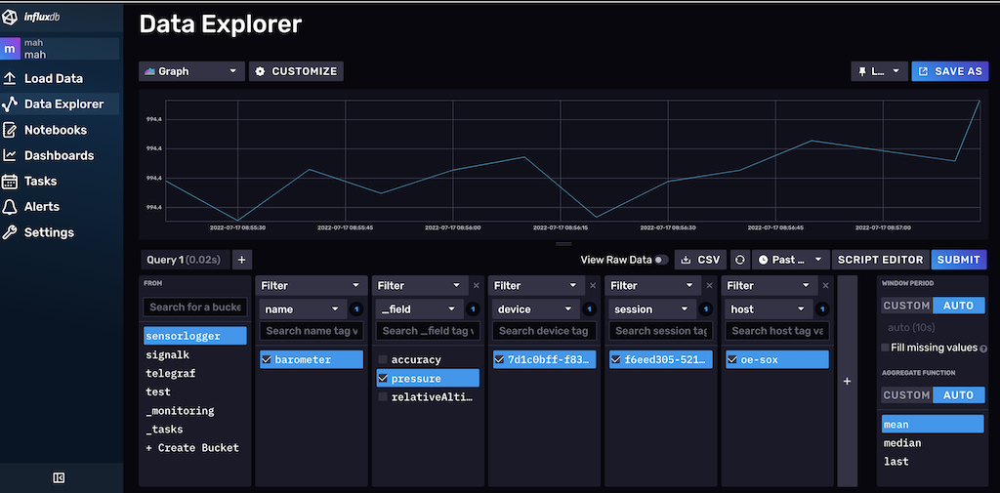

# Telegraf for sensorlogger recording via HTTP push

This telegraf config for InfluxDB V2 creates an HTTP endpoint which can be used to directly stream sensorlogger examples into InfluxDB.

Tested under Debian bullseye with:
```
influxdb2:amd64/bullseye 2.3.0-1 
influxdb2-cli:amd64/bullseye 2.3.0 
telegraf:amd64/bullseye 1.23.2-1 
```

# Installation

* create a bucket for sensorlogger data
* create an API token with write access to this bucket
* edit the sensorlogger.conf section `outputs.influxdb_v2` filling in token, organisation, bucket and destination URL(s)
* adapt listener endpoint under `inputs.http_listener_v2` as needed for host and port
* install under /etc/telegraf
* `systemctl restart telegraf`


# stock InfluxDB parts used:

* [HTTP Listener plugin v2](https://github.com/influxdata/telegraf/blob/release-1.23/plugins/inputs/http_listener_v2/README.md)
* [JSON Parser Version 2 Plugin](https://github.com/influxdata/telegraf/blob/release-1.23/plugins/inputs/http_listener_v2/README.md)
* [InfluxDB V2 writer](https://github.com/influxdata/telegraf/blob/release-1.23/plugins/outputs/influxdb_v2/README.md)

# InfluxDB explorer example view

device, session and sensor name are stored as tags:




# Bugs

Currently there is no authentication.
